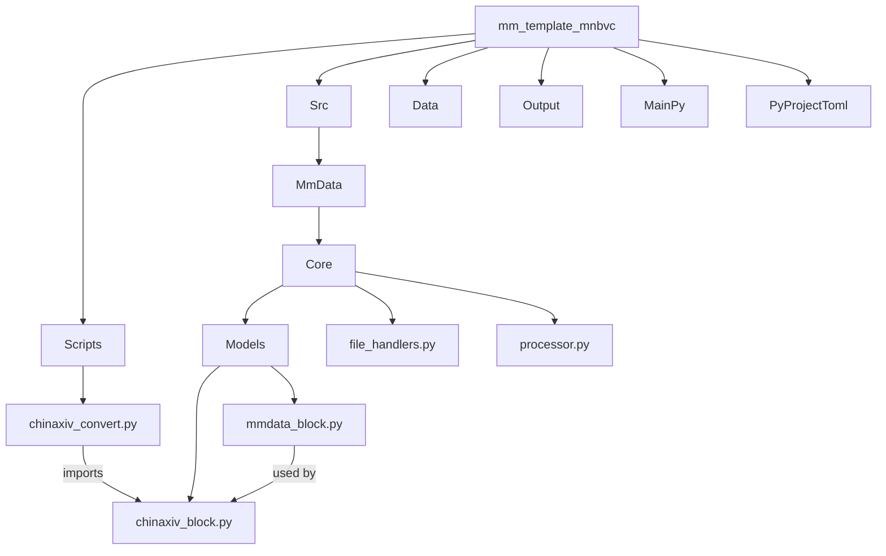

# MM Data Converter for MNBVC

## 简介

将文本文件转换为 MNBVC 多模态数据格式，并保存为 Parquet 文件。该仓库为模板仓库，需要根据实际情况修改。

## 环境配置

使用 uv 作为 Python 包管理工具。

```bash
uv sync
```

## 使用

pdfcontent 转换

``` bash
# step 1 
git submodule update --remote # 拉取子模块

# step 2 使用 parser 处理 pdf

# step 3 将 jsonl 转 parquet
```


## 参数

- `input_file`: 输入文件路径
- `output_file`: 输出文件路径
- `split_size`: 每个 parquet 文件的大小
- `log_dir`: 日志文件路径

## 代办

- [ ] 添加视频、音频等模态的支持
- [ ] 统一各模态数据解析入口
- [ ] 添加数据解析结果验证
- [ ] 添加数据解析结果统计(字数、图片数量、视频数量、音频数量、OCR 数量、STT 数量)
- [ ] cli 接口

## pr 规范
1. src/mm_data/core/models 完成数据 block 类、辅助函数
2. scripts 完成转换脚本
3. data 提交示例数据（使用 lfs 提交）

## 框架

