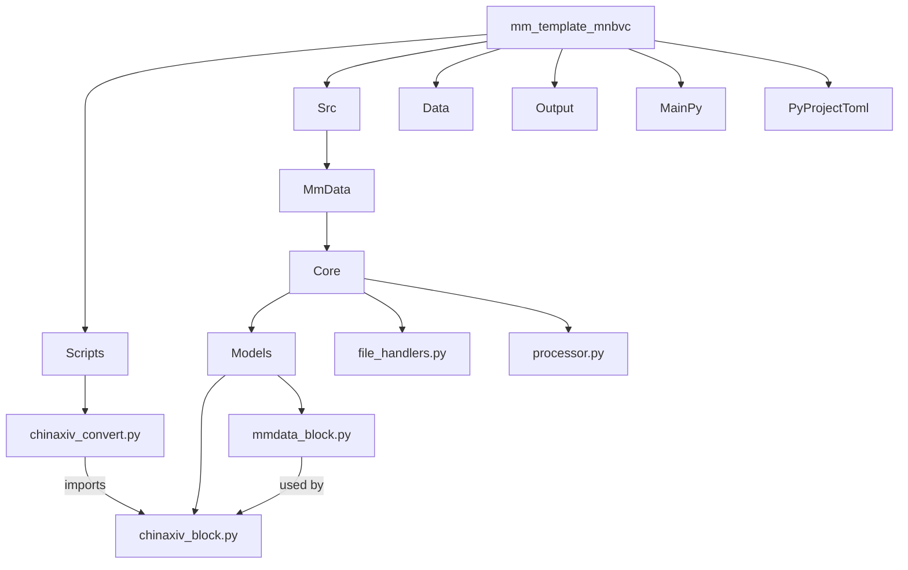

# MM Data Converter for MNBVC

## 简介

将文本文件转换为 MNBVC 多模态数据格式，并保存为 Parquet 文件。该仓库为模板仓库，需要根据实际情况修改。

## 环境配置

使用 uv 作为 Python 包管理工具。

```bash
uv sync
```

## 使用

```bash
# python main.py --input_file input.txt --output_file output.parquet --split_size 200 --log_dir logs

python scripts/chinaxiv_convert.py -i data/list.txt -o output -t image-text-pair -l logs
```

## 参数

- `input_file`: 输入文件路径
- `output_file`: 输出文件路径
- `split_size`: 每个 parquet 文件的大小
- `log_dir`: 日志文件路径

## 数据格式

schema 在 `src/mm_data/core/models/mmdata_block.py` 的 `BLOCK_SCHEMA`，
所有写出路径都走 `processor.write_blocks`，不再让 pandas 推断类型。

| 列 | 类型 | 说明 |
|---|---|---|
| `实体ID` | string | 块的来源标识 |
| `md5` | string | **内容**的 md5（不是文件名的） |
| `块ID` | int32 | 文档内递增 |
| `块类型` | string | `pdf` \| `image-text-pair` \| `video` \| `audio` |
| `扩展字段` | string | JSON 字符串，各模态自定义 |
| `时间` | string | `YYYYMMDD` |
| `页ID` | int32 | 分页模态的页码，0 起 |
| `文本` | large_string | |
| `图片` `视频` `音频` | struct\<bytes, path\> | 见下 |
| `OCR文本` `STT文本` | large_string | |

### 媒体列为什么是 struct 而不是 base64

HuggingFace `datasets` 的 `Image` / `Audio` / `Video` 三个 feature 用的都是
`struct<bytes, path>`。按这个定型才能直接解码：

```python
from datasets import load_dataset, Image
ds = load_dataset("parquet", data_files="out/*.parquet", split="train")
ds = ds.cast_column("图片", Image())
ds[0]["图片"]   # -> PIL.Image
```

换成 base64 字符串或者裸 binary 都会抛
`ArrowNotImplementedError: Unsupported cast ... to struct`。

体积上没有区别——15 页 1191x1684 PNG，zstd 之后 base64 是 9.65 MiB、
struct 是 9.66 MiB（base64 撑大 1/3，但 zstd 正好能吃掉这部分冗余）。
差别在别处：写快 55%、读快 81%、未压缩内存少 25%，以及省掉 1.2 ms/页 的
base64 解码。

想改回裸二进制的话，把 `MEDIA_TYPE` 换成 `pa.large_binary()` 即可，读端自己
`PIL.Image.open(io.BytesIO(...))`。无论存成哪种形态，读端都可以用
`decode_media()` 屏蔽差异（struct / bytes / base64 三种都吃），迁移期不用分支。

## 测试

```bash
uv run pytest tests -q
```

## 代办

- [ ] 添加视频、音频等模态的支持
- [ ] 统一各模态数据解析入口
- [x] 添加数据解析结果验证（显式 schema + tests）
- [ ] 添加数据解析结果统计(字数、图片数量、视频数量、音频数量、OCR 数量、STT 数量)
- [ ] cli 接口

## pr 规范
1. src/mm_data/core/models 完成数据 block 类、辅助函数
2. scripts 完成转换脚本
3. data 提交示例数据（使用 lfs 提交）

## 框架


```mermaid
graph TD
    Root["mm_template_mnbvc"] --> Scripts & Src & Data & Output & MainPy & PyProjectToml
    
    Scripts --> ChinaxivConvert["chinaxiv_convert.py"]
    Src --> MmData
    MmData --> Core
    Core --> Models & FileHandlers["file_handlers.py"] & ProcessorPy["processor.py"]
    Models --> ChinaxivBlock["chinaxiv_block.py"] & MmDataBlock["mmdata_block.py"]
    
    ChinaxivConvert -- "imports" --> ChinaxivBlock
    MmDataBlock -- "used by" --> ChinaxivBlock
```